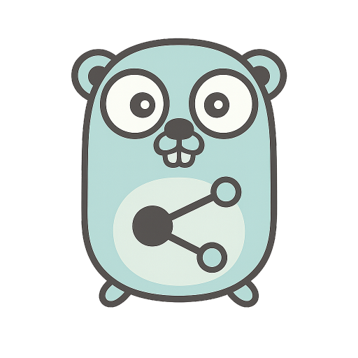

<div align="center">
  

# Headscale Client Go

_A Go client for the [Headscale](https://headscale.net) HTTP API._

[](https://pkg.go.dev/github.com/hibare/headscale-client-go)
[](https://goreportcard.com/report/github.com/hibare/headscale-client-go)

</div>

## Features

- Manage **API Keys**: List, create, expire, and delete API keys.
- Manage **Nodes**: List, get, register, delete, expire, rename, tag, update user, and backfill IPs for nodes.
- Manage **Users**: List, create, delete, and rename users.
- Manage **Policies**: Get and update policy documents.
- Manage **Pre-Auth Keys**: List, create, and expire pre-auth keys.
- Customizable HTTP client, user agent, and logger support.
- Idiomatic Go API with context support.

---

## Installation

Requires **Go 1.26+** and **Headscale v0.28.0** & above.

```sh
go get github.com/hibare/headscale-client-go
```

---

## Usage

See the [`examples/`](examples/) directory for usage examples.

### API Overview

The client exposes resource interfaces for each Headscale API resource:

- `client.APIKeys()` – Manage API keys
- `client.Nodes()` – Manage nodes
- `client.Users()` – Manage users
- `client.Policy()` – Manage policy
- `client.PreAuthKeys()` – Manage pre-auth keys

Each resource provides methods for CRUD and management operations. See [pkg.go.dev](https://pkg.go.dev/github.com/hibare/headscale-client-go) for full API documentation.

---

## Development & Contributing

- **Run tests:**

  ```sh
  make test
  ```

- **Lint:**

  ```sh
  make install-golangci-lint
  golangci-lint run
  ```

- **Pre-commit hooks:**

  ```sh
  make install-pre-commit
  pre-commit run --all-files
  ```

- **Formatting:**

  ```sh
  go fmt ./...
  ```

Contributions are welcome! Please open issues or pull requests.

---

## License

This project is licensed under the MIT License. See [LICENSE](LICENSE) for details.

---

## Links

- [Headscale](https://headscale.net)
- [pkg.go.dev Documentation](https://pkg.go.dev/github.com/hibare/headscale-client-go)
- [GitHub Issues](https://github.com/hibare/headscale-client-go/issues)
